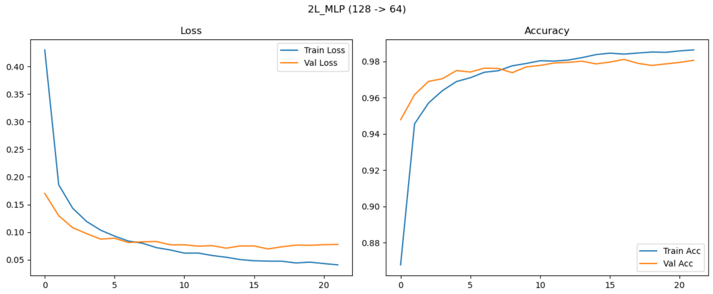
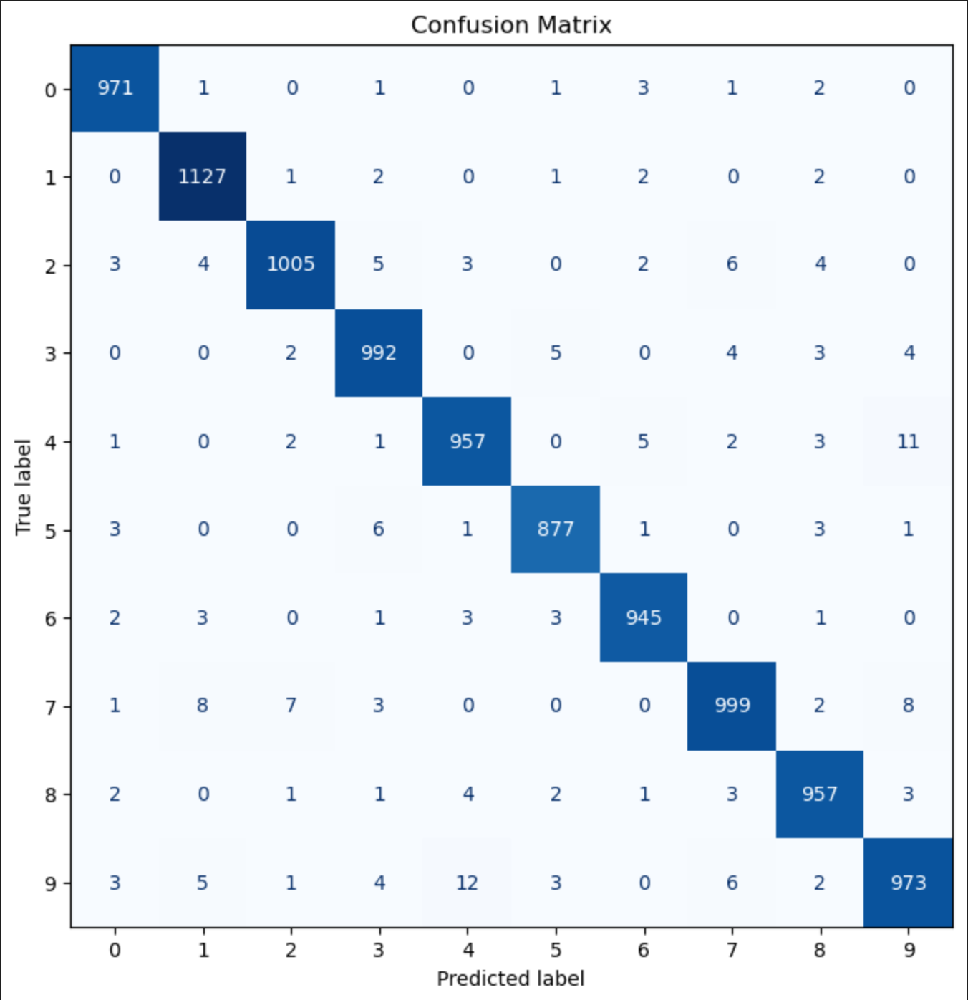
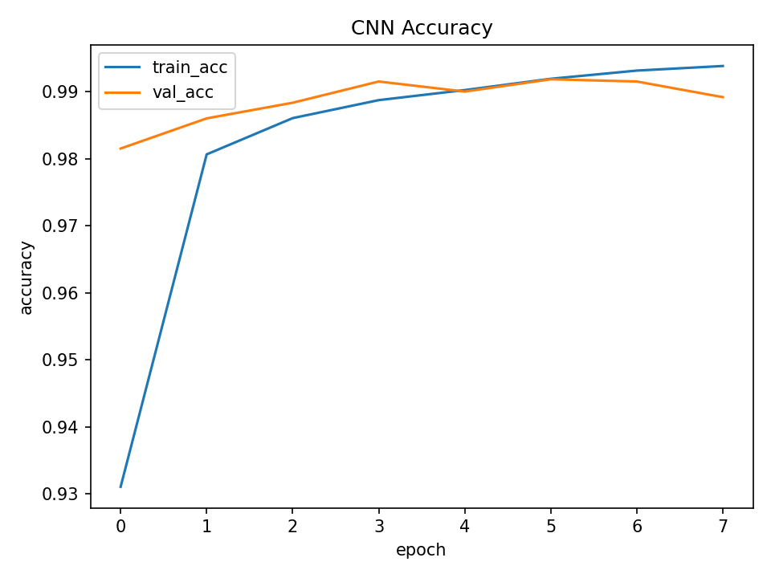
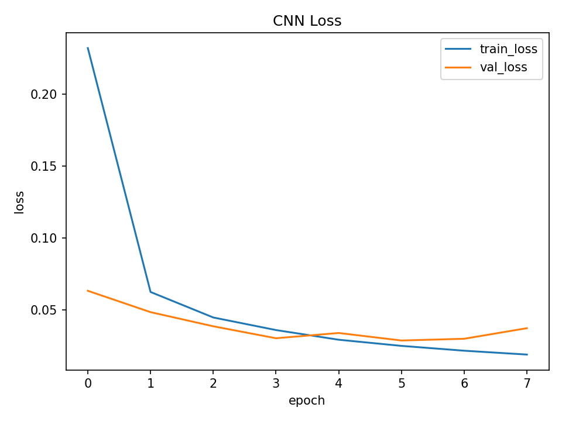
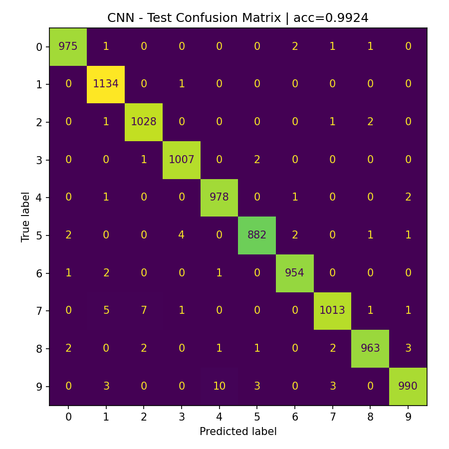

# patternrecognition-group1
## Some generalities
> uv is needed to run this project
 
## To run a script
1. Go to the root of the repo
2. ```uv run pathtothescript```
3. Wait

## Data folder structure
```
data
|- Fashion-MNIST
|   |- All files of the datasets
|- MNIST
|   |- All files of the datasets
```

## Implementation
### SVM

!!!!!!!!!!!!!!!!!!!!!!!!!!!!!!!!!!!!!!!!!!!
Add some lines about your choices, implementation whatever


#### Results


Accuracy: ~0.983

### MLP
!!!!!!!!!!!!!!!!!!!!!!!!!!!!!!!!!!!!!!!!!!!
Add some lines about your choices, implementation whatever

#### Results



Test accuracy: 0.980

### CNN
We experimented with kernel size, number of convolutional layers, and learning rate.
The best-performing model used two convolutional layers, kernel size 5, and learning rate 0.001, achieving a validation accuracy of 99.18% and test accuracy of 99.24%.
Smaller kernels or lower learning rates slightly reduced accuracy, while a single-layer CNN underperformed.
The validation and test metrics were closely aligned, indicating excellent generalization and minimal overfitting.


#### Results




## Discussion

On the MNIST dataset, adding more convolutional layers usually provides only very small improvements, because the images are simple, grayscale, and low-resolution. Two convolutional layers are already enough to capture the essential hierarchical features — from edges to digit shapes — and achieve test accuracies around 99 %. Deeper models can slightly increase accuracy (perhaps by 0.1 – 0.3 %) but at the cost of longer training times and a higher risk of overfitting, so ... worth trying?

**Table 1 – Comparison of Classifier Performance**
| Model | Validation Accuracy | Test Accuracy | Key Hyperparameters |
|--------|---------------------|----------------|---------------------|
| SVM (RBF) |  |  |  |
| MLP (1 hidden = 128) |  |  |  |
| CNN (2 conv × 5×5) | 99.1 % | 99.0 % | lr = 0.001, dropout = 0.25 |

Table 1 provides a comparison of the final test accuracies obtained by the three classifiers.  
The CNN achieved the highest accuracy, confirming the advantage of spatial feature extraction over the fully connected MLP and the kernel-based SVM for image data.  
*(Note: This text and the table serve as an example/template and need to be adapted once everybody have added their final results.)*

